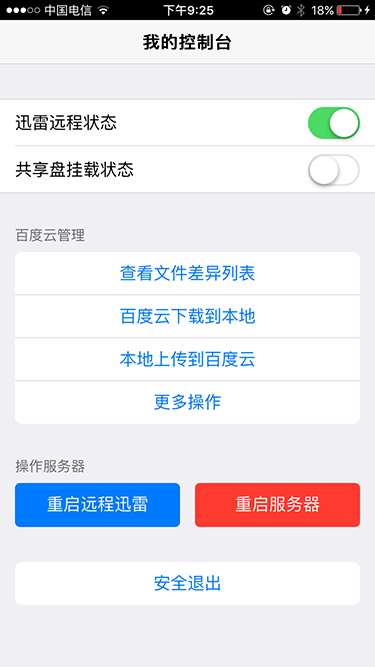
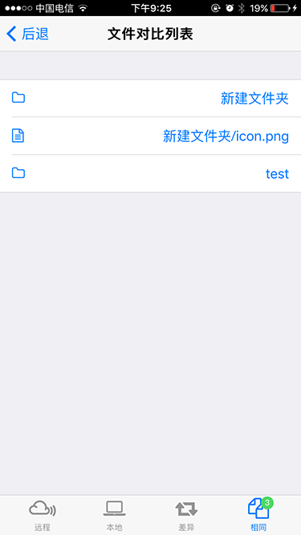
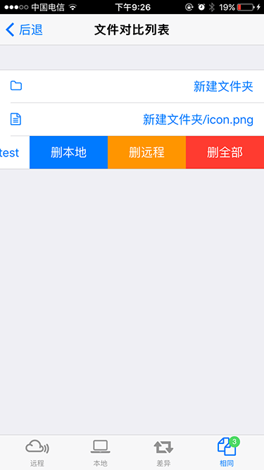
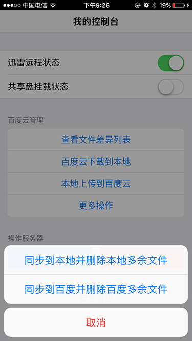

# Linaro Server Console

这个服务器控制页面是我为自己的 Cubieboard2 （ubuntu server）做的一个功能，目前做好了远程迅雷的开启关闭、百度云同步管理，重启服务器等功能。适合喜欢自己diy并熟悉linux的人，也可以用于像树莓派这样的卡片服务器。



## 简要说明
由于 Cubieboard2 并没有大的硬盘，所以远程迅雷的下载依赖扩展硬盘，我是直接用afp挂载Apple Time Capsule (有2T硬盘)的共享盘，实际上 Capsule 也支持 smb 协议（window共享）但是我用这个协议挂载后远程迅雷下载有异常，所以代码理仍旧是 afp 的挂载协议。

百度云是用的 [https://github.com/houtianze/bypy](https://github.com/houtianze/bypy) 这个 python 客户端，虽然号称支持Python 2.7+, 3.3+，但还是确保 3.3+ 版本。


## 代码说明

server 目录是服务端接口的代码，自启动在83端口，html 目录是放在nginx或apache目录里的。
可以把 server 目录代码放在 /root/server-console/ 目录，然后建立一个链接 `ln -s /root/server-console/server /usr/local/bin/server-console`

前端页面主要集中在 html/index.html 中，服务器接口主要集中在 server/lib/onrequest.php 里


## 运行说明
自启动可以把 `/usr/local/bin/server-console` 放在 `/etc/rc.local` 中

命令支持：

* 启动 server-console
* 重加载 server-console reload
* 停止 server-console stop

注意，这边的重加载是重新加载 server/lib/ 里的子进程服务，并不是重启这个API服务，如果要完全重启，可 `killall php` 后重新启动

### 创建用户
请在 server 目录中创建一个 `user.ini` 文件，key是用户名，value是 `sha1("密码_abcdef123456")` 的值，比如密码是 123456 ，则应该是 `sha1("123456_abcdef123456")` 值是 `f9e1e93dcd622af1b5cad396f52127ae259e6e9d`

类似
```
admin = 586b1ec570cc4c9c89ec65127580930fe6bf01e7
test = f9e1e93dcd622af1b5cad396f52127ae259e6e9d
```
其中，admin 的密码是 admin， test 的密码是 123456


## 环境安装

首先安装 nginx + php-fpm 或 apache 的php运行环境，这个网上比较多这边就不多说了。

以下为 ubuntu 系统中的安装说明，我的cb主板用的 linaro server 就是 ubuntu的，有13.06 和 14.04 ，我都试过，都可以。

服务端使用了 [swoole](http://www.swoole.com/) 这个php插件做的，所以先编译下插件

```
apt-get install php5-dev libpcre3-dev make
cd ~
wget https://github.com/swoole/swoole-src/archive/swoole-1.8.1-stable.tar.gz
tar zxvf swoole-1.8.1-stable.tar.gz
cd swoole-1.8.1-stable
phpize
```
然后会看到类是这样的输出
```
Configuring for:
PHP Api Version:         20100412
Zend Module Api No:      20100525
Zend Extension Api No:   220100525
```

继续
```
./configure
make
make install
```

如果不安装 libpcre3-dev 会报以下错误
```
In file included from /usr/include/php5/ext/spl/spl_iterators.h:27:0,
                 from /root/swoole-src-swoole-1.8.1-stable/swoole.c:28:
/usr/include/php5/ext/pcre/php_pcre.h:29:18: fatal error: pcre.h: No such file or directory
compilation terminated.
make: *** [swoole.lo] Error 1
```

将会看到类似的输出
```
Installing shared extensions:     /usr/lib/php5/20100525+lfs/
```
先看下php的配置的目录
```
php --ini
```
输出类似
```
Configuration File (php.ini) Path: /etc/php5/cli
Loaded Configuration File:         /etc/php5/cli/php.ini
Scan for additional .ini files in: /etc/php5/cli/conf.d
Additional .ini files parsed:      /etc/php5/cli/conf.d/10-pdo.ini,
/etc/php5/cli/conf.d/20-mysql.ini,
/etc/php5/cli/conf.d/20-mysqli.ini,
/etc/php5/cli/conf.d/20-pdo_mysql.ini
```

继续执行，注意目录

```
echo "extension=swoole.so" > /etc/php5/cli/conf.d/swoole.ini
/etc/init.d/apache2 restart
php --ri swoole
```

然后看到下面的输出就表示插件安装成功了
```

swoole

swoole support => enabled
Version => 1.8.1
Author => tianfeng.han[email: mikan.tenny@gmail.com]
epoll => enabled
eventfd => enabled
timerfd => enabled
signalfd => enabled
cpu affinity => enabled
spinlock => enabled
rwlock => enabled
Linux Native AIO => enabled
GCC AIO => enabled
pcre => enabled
zlib => enabled
mutex_timedlock => enabled
pthread_barrier => enabled

Directive => Local Value => Master Value
swoole.aio_thread_num => 2 => 2
swoole.display_errors => On => On
swoole.use_namespace => Off => Off
swoole.message_queue_key => 0 => 0
swoole.unixsock_buffer_size => 8388608 => 8388608

```

接下来安装 bypy，官网有说明，这边再写下
```
apt-get install git python3-pip
pip3 install -U requests
cd ~
git clone https://github.com/houtianze/bypy.git
cd bypy
ln -s /root/bypy/bypy.py /usr/local/bin/bypy.py
```

执行 `./bypy.py ls` 后输出类似的URL，用页面打开，把里面的授权码复制下来贴进去就耗量

https://openapi.baidu.com/oauth/2.0/authorize?scope=basic+netdisk&redirect_uri=oob&response_type=code&client_id=aaaaaaaaaaaa


## 功能截图









